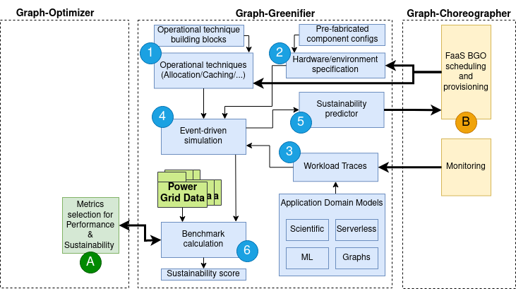

# graph-greenifier

## Description
**DESCRIPTION PARAGRAPHS**

|| Description |
| ---- | ---- |
|Interface||
|Documentation||
|README||
|License||
|External Libraries||
|Programming Languages||
|Language Dependencies||
|Software Development Process||
|Build Process||

### Examples

[[EXAMPLE]]

Description...

[[EXAMPLE]]

Description...

## Integration
**DESCRIPTION PARAGRAPHS**

### Dependencies
|| Description |
| ---- | ---- |
|Tool and Toolkit Inputs||
|External Inputs||
|System States||
|Formats and Standards||

### Artifacts
|| Description |
| ---- | ---- |
|Software Artifacts||
|Data Outputs||
|Visualizations/Public-Facing Outputs||
|Interactive Demos or Components||
|Internal Actions and Activities||

## Tests
| Test | Validates Condition | Pass/Failure Criteria | Description |
| ---- | ------------------- | --------------------- | ----------- |
|||||
