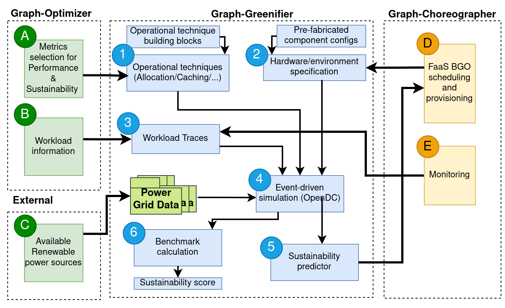

# Graph-Greenifier
This repository contains the Graph-Greenifier tool. This tool creates execution plans and predicts their performance and sustainability using simulation. 
An execution plan is a method of executing tasks on a given data center. Execution plans differ in when they execute specific tasks, and on which machines. 
Graph-Greenifier uses the output from the Graph-Optimizer tools as input. The output generated by Graph-Greenifier is used by the Graph-Choreographer for scheduling purposes. 

## Description
In short, the Graph-Greenifier performs the following functions:

- Simulate the given workload of BGOs using the discrete-event simulator OpenDC.
- Execute multiple different execution plans that execute the given workload in different ways, such as different scheduling or resource allocation. 
- Determine the energy usage of a data center when executing a given execution plan. 
- Determine the machine utilization of a data center when executing a given execution plan.
- Combine the energy usage of a data center with power grid data to determine the carbon footprint

### Architecture Diagram

The architecture of Graph-Greenifier consists of six sections:

1. Operational techniques define all factors that can influence the way a workload is executed. Examples of these are the scheduling algorithm or allocation policy that is used. 
2. Graph-Greenifier requires information about the available hardware. This information is provided by the Graph-Choreographer.
3. Workload traces define what tasks should be executed, when they are submitted, and in which order they should be executed. In Graph-Massivizer, the workload is provided by the Graph-Optimizer. 
4. The Event-driven simulator replays the given workload on the available hardware. Graph-Greenifier is built upon the [OpenDC](https://opendc.org/) framework. The simulation predicts various metrics such as the hardware utilization, total runtime, and energy usage.
5. The energy usage of the data center during the workload is combined with information on the Power Grid, to create a sustainability report. This report is sent to the Graph-Choregrapher.
6. The energy usage of the data center during the workload is combined with information on the Power Grid, to create a sustainability report. This report is used to determine a sustainability score. 

### Examples
An example of the Graph-Greenifier tool in action is provided as a [demo](demo). 
The demo shows how Graph-Greenifier takes input from the Graph-Optimizer to create multiple execution plans for the Graph-Choreographer. For each execution plan, a performance and sustainability report is created.  

The demo can be executed by using running the [notebook](demo/demo.ipynb).

## Requirements

To properly use Graph-Greenifier, the following things have to be installed:
- **Java** (version >= 19)
- **Python** (version >= 3.8)
- **pip** 
- See the python packages required [here](requirements.txt)

